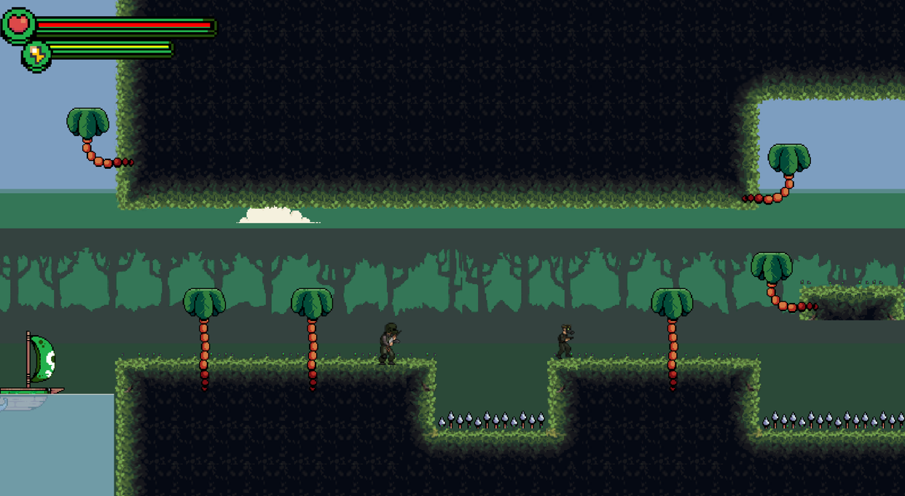
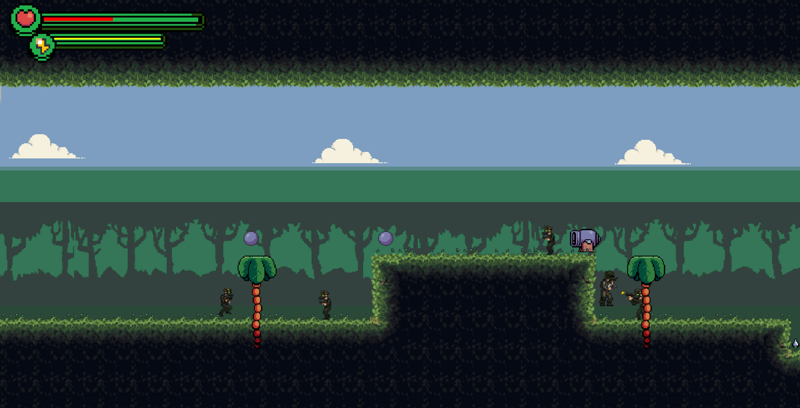

# War Hero 2DJavaGame

War Hero is a 2D single-player platform game where the player takes on the role of a soldier fighting for his country against enemy forces. The game is divided into three levels, each with its own challenges and unique enemies.

## Installation and Setup

1. Ensure you have JDK 16 installed.
2. Clone the repository:
   ```sh
   git clone https://github.com/Drexel7/WarHero_2DGame.git
3. Navigate to the project directory:
   ```sh
   cd WarHero_2DGame
4. Compile the project:
   ```sh
   javac -source 16 -target 16 -d bin src/*.java
5. Run the game
   ```sh
   java -cp bin MainClass
## Game Overview

### Level 1 
- These are standard soldiers armed with rifles or machine guns. They move back and forth in a straight line and can only be defeated with one shot. They have normal movement speed (1.0x) and can be easily eliminated.



### Level 2
-  These enemies are armed with a very powerful gun and move quickly towards the player to take him down. They can be defeated with two bullets. They have accelerated speed(1.5x) and are harder to avoid than Rifleman.



### Level 3
- These enemies are heavily armored and move very quickly towards the player. They have great strength and can be defeated with three bullets. They are the fastest of the three enemies(2.0x), which causes a high attention of the soldier.


